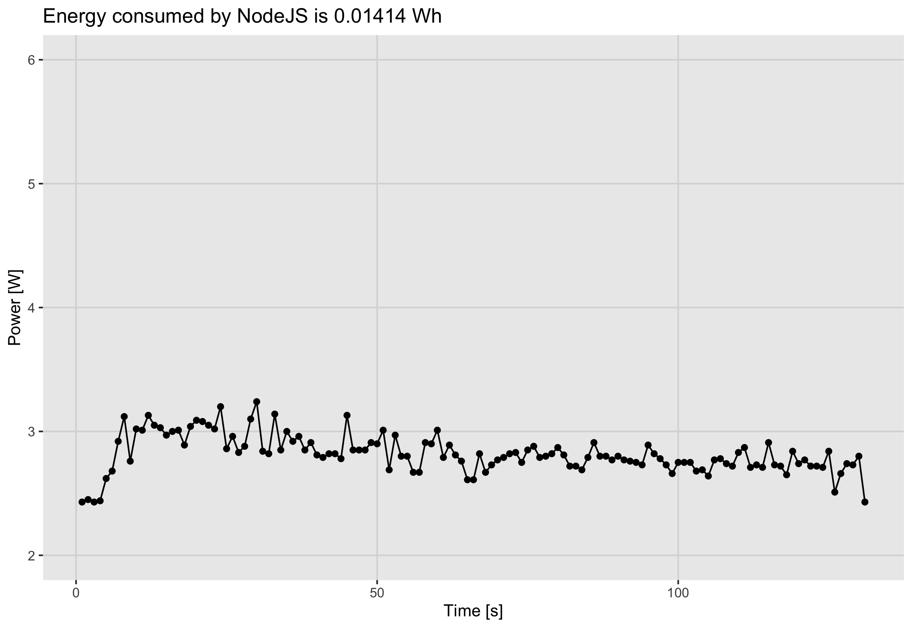
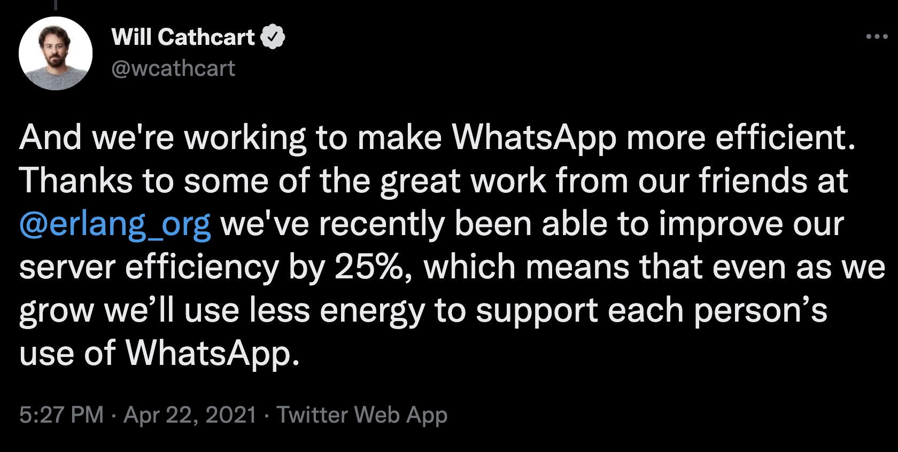

class: middle, center

# A case study about Comparative Programming Languages' Energy Consumption

Aleksander Lisiecki

.right[AlekLisiecki @ Twitter]
.right[aleklisi @ GitHub]
.right[aleksander.lisiecki@erlang-solutions.com]

---
# **Where** does electrical energy consumption matter?

 - IoT
 - Electric cars
 - Smartphones and laptops
 - Spacecrafts, satellites, probes
 - ...

---

.scale60[]
[1]

---
# But not only there...

"Last year, Google used about **12.4 terawatt-hours** of electricity, which means it uses more electric power than entire countries, including ones like Sri Lanka and Zambia." [2] the article is form 2020

Total electricity used by Meta (Facebook) in 2020 was **7,170,000 MWh**. [3]

Total electricity used by Microsoft in 2019 was **8,741,807 MWh**. [4]

"In 2020, the average annual electricity consumption for a U.S. residential utility customer was 10,715 kilowatthours (kWh)[...]" [5]

| Company | energy used in kWh | Residential utilities equivalent |
|--:-|---:|---:|
| Google | 12,400,000,000 | 1,157,256 |
| Microsoft | 8,741,807,000 | 815,847 |
| Meta(Facebook) | 7,170,000,000 | 669,155 |

---
# **Why** does it matter?

.scale45[]
.scale45[]

[7] [8]

---
class: middle, center
# What should we do to save the electrical energy?

---
# We could give up electricity completely

.scale80[]

[9]

---
class: middle, center
# We could use energy efficient technologies

---
# What is electrical current?

"An **electric current** is a stream of charged particles, such as electrons or ions, moving through an electrical conductor or space." [10]

.scale45[]
.scale45[]

[11] [12]

---
# What is electrical current? (for common people)
.scale60[]

[13]

---
# Power

"**Electric power** is the rate, per unit time, at which electrical energy is transferred by an electric circuit." [14]

P = V * I

where:
- P is electric power in watts [W]
- I is electric current in amperes [A]
- V is electric potential or voltage in volts [V]

---
# Energy

"**Electrical energy** is energy derived as a result of movement of electrically charged particles. When used loosely, electrical energy refers to energy that has been converted from electric potential energy." [15]

E = P * t

where:
- E is electrical energy in jules [J]*
- P is electric power in watts [W]
- t is time [s]

*"Electrical energy is usually sold by the kilowatt hour (1 kW·h = 3.6 MJ) which is the product of the power in kilowatts multiplied by running time in hours."[15]

*I promise this is as hard as it gets with the maths in this talk!*

---
# From theory ...

.scale90[]

---
# ... to practice

.scale45[]
.scale45[]

---
# The benchmark assumptions

* microservice
* solve commonly known problem
* use default programming language's settings
* easy to implement
* include different aspects of programming

---
# My benchmark

An HTTP service with a single endpoint to multiplying matrixes it is given as an JSON input:

Request:
```json
{
    "A": [ [1, 2],
           [3, 4] ], "A_Len": 2, "A_Height": 2,
    "B": [ [5, 6],
           [7, 8]], "B_Len": 2, "B_Height": 2
}
```
Response:
```json
{
    "AxB": [
        [23, 34],
        [31, 50]
    ], "AxB_Len": 2, "AxB_Height": 2
}
```
---
# Some of the results (1)

.scale45[]
.scale45[]
.scale45[]

---
# Some of the results (2)

|Programming language  | Energy consumed [Wh] |
|:---|:---|
| NodeJS | 0.01238 |
| Python | 0.01875 |
| Erlang | 0.08746 |

---
# Which is the most efficient one?

"Energy Efficiency across Programming Languages 
How Do Energy, Time, and Memory Relate?"

by 
 - Rui Pereira,
 - Marco Couto, 
 - Francisco Ribeiro, 
 - Rui Rua, 
 - Jácome Cunha,
 - João Paulo Fernandes,
 - João Saraiva

"The paper presents a study of the runtime, memory usage
and energy consumption of twenty seven well-known software languages."
[16]

---
# Results from the paper

.scale27[]
.scale27[]
.scale27[]

[16]

---
# Conclusions from the paper (1)

"Execution time behaves differently when compared to energy efficiency. The results [...] show several scenarios where a certain language energy consumption rank differs from the execution time rank [...].  In the `fasta` benchmark, for example, the Fortran language is second most energy efficient, while dropping 6 positions when it comes to execution time." [16]

"[...]we can have languages with very similar energy consumptions and completely different execution times" [16]

"Compiled languages tend to be, as expected, the fastest and most energy efficient ones. [...] This tendency can also be observed for execution time [...]" [16]

---
# Conclusions from the paper (2)

"[...] we can see that the **C language** is, overall, the fastest and** most energy efficient**." [16]

.scale45[]

---
class: middle, center
# Is it all about efficiency?

---
# Sorry Mr. Torvalds but **NO**!

"Lua is a tiny and simple language, partly because it does not try to do what C is already good for, such as sheer performance, low-level operations, or interface with third-party software. Lua relies on C for those tasks." [17]

---
# Facebook Messenger using MQTT

"One of the problems we experienced was long latency when sending a message. The method we were using to send was reliable but slow, and there were limitations on how much we could improve it. With just a few weeks until launch, we ended up building a new mechanism that maintains a persistent connection to our servers. **To do this without killing battery life, we used a protocol called MQTT** that we had experimented with in Beluga. **MQTT is specifically designed for applications like sending telemetry data to and from space probes, so it is designed to use bandwidth and batteries sparingly**. By maintaining an MQTT connection and routing messages through our chat pipeline, we were able to often achieve phone-to-phone delivery in the hundreds of milliseconds, rather than multiple seconds."

[18]

---
# Whatsapp upgrading Erlang and using JIT

.scale80[]

---
class: middle, center

# Thank you for your attention
